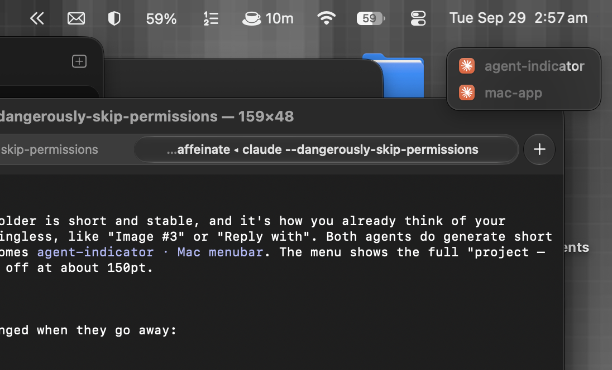

# Agent Indicator

A tiny always-on-top macOS indicator that shows what your **Claude Code** and **Codex** sessions are doing while you're in other apps.



When you switch away from your terminal, you lose sight of whether the agent is still working, waiting on you, or done. Agent Indicator keeps a small translucent list in a corner of the screen with one row per chat:

| Row looks like | Meaning |
| --- | --- |
| Shimmering text | The agent is working |
| Orange text | It's waiting for you (permission prompt or question) |
| Dimmed text | The turn finished |

The list resizes to fit the active chats and disappears when nothing is going on.

## Features

- **Real time.** Updates arrive in about 20 ms and nothing is polled on a timer.
- **Click to jump.** Clicking a row brings up that session:
  - Terminal.app and iTerm2 select the exact tab.
  - Codex desktop chats open directly with `codex://threads/<id>`.
  - Any other host app (Warp, Cursor, VS Code, Ghostty, the Claude app) is brought to the front.
- **One row per chat.** A new message in the same chat reuses its row, and Codex subagent threads fold into their parent chat.
- **Short labels.** Each row shows the project folder. When two chats share a folder, the first words of the chat title are added.
- **Stays out of the way.** It floats above other windows on every Space, including full-screen apps, and never takes focus.
- **Zero setup.** It uses no hooks, needs no config changes, and makes no network requests.

## Settings

Everything lives in the menu bar icon:

- **Position**: top left, top right (default), bottom left or bottom right.
- **Layout**: vertical (default) or horizontal.
- **Labels**: project name (default), chat title, or icons only. Icons Only shows a spinner, orange **!** or green **✓** instead of styled text.
- **Show Finished**: how long finished chats stay (don't show, 1, 5 (default), 15 or 60 minutes, or while the session is open).
  - **Remove on Hover** (off by default): clear finished chats when the pointer leaves the list, or when you click them.
- **Agents**: turn Claude and Codex on or off.
- **Launch at Login**.

The menu also lists every session with its full project name and chat title. Clicking one jumps to it.

## Install

Requires macOS 13 or later and the Xcode Command Line Tools (`xcode-select --install`). Full Xcode isn't needed.

```sh
git clone https://github.com/kartikk-k/agent-indicator.git
cd agent-indicator
./build.sh
open "build/Agent Indicator.app"
```

To keep it around, move `build/Agent Indicator.app` to `/Applications` and turn on **Launch at Login** from the menu.

The first time you click a Terminal or iTerm2 session, macOS asks for permission to control that terminal. That permission is only used to select the right tab. The app is ad-hoc signed, so macOS may ask again after a rebuild.

## How it works

Agent Indicator only reads files the agents already write locally.

**Claude Code** keeps a live registry of running sessions in `~/.claude/sessions/<pid>.json`. Each session rewrites its `status` (`busy`, `shell`, `waiting` or `idle`) the moment it changes, and deletes the file on exit. Chat titles come from the `ai-title` entries in the session transcript under `~/.claude/projects/`.

**Codex** (CLI and desktop app) appends turn events to `~/.codex/sessions/**/rollout-*.jsonl`: `task_started`, `task_complete`, `turn_aborted` and approval requests. A chat counts as open while a Codex process holds its rollout file open, which the app checks with `libproc`. Files are tailed incrementally, so large logs are never re-read. Chat titles come from `~/.codex/session_index.jsonl`.

Both folders are watched with file-level FSEvents and no coalescing delay. A 1.5-second sweep catches crashed processes and expires finished rows.

`CLAUDE_CONFIG_DIR` and `CODEX_HOME` are respected. Run the binary with `--debug` to print what it sees:

```sh
"build/Agent Indicator.app/Contents/MacOS/AgentIndicator" --debug
```

## Limitations

- The Claude Code session registry is an internal file, not a documented API, so a future Claude Code release could change its format.
- Jumping to the exact tab only works in Terminal.app and iTerm2. Other apps are brought to the front, but not to a specific window. tmux isn't supported yet.
- A Codex session that crashes mid-turn disappears within about 1.5 seconds instead of instantly.

## Project layout

```
Sources/
  main.swift          App delegate, menu bar menu, settings
  Overlay.swift       Floating panel, rows, shimmer, icons
  Model.swift         Session model, state reconciliation, labels
  ClaudeSource.swift  Claude Code session registry + chat titles
  CodexSource.swift   Codex rollout tailing + open-file discovery
  Focuser.swift       Click-to-focus (terminal tab / deep link / app)
  FileWatcher.swift   FSEvents wrapper
Resources/Info.plist
build.sh
```
